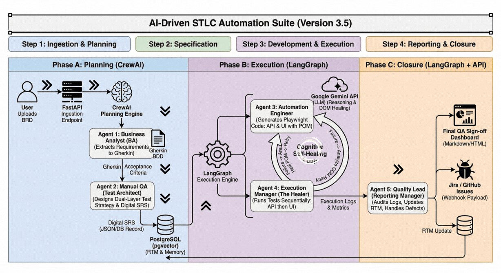

# AI-Driven STLC Automation Suite WorkFlow


# Project Documentation: AI-Driven STLC Automation Suite
#### Project Owner: MD Muhiuddin, SQA Engineer
#### Architecture: Multi-Agent Hybrid (CrewAI + LangGraph)
#### Deployment Environment: Dockerized application optimized for Linux servers.


## 📑 Project Documentation Index
| Section | Key Focus |
| :--- | :--- |
| 🎯 [Executive Summary](#1-executive-summary) | High-level goals and the "Why" behind the suite. |
| 💻 [Technology Stack](#2-technology-stack) | Deep dive into FastAPI, Gemini, and Agentic frameworks. |
| 📋 [Requirement Strategy](#3-the-hybrid-requirement-strategy-phase-a) | Gherkin vs. Digital SRS methodology. |
| 🤖 [5-Agent Architecture](#31-the-5-agent-architecture-in-detail) | Detailed breakdown of Phase A, B, and C agents. |
| 🔄 [Sequential Data Flow](#4-sequential-data-flow) | Step-by-step logic from Ingestion to Sign-off. |
| 🛠️ [Framework Standards](#5-automation-framework-standards-scalability--maintenance) | POM, Parallelism, and Cognitive Self-Healing. |

---


## 1. Executive Summary

The AI-Driven STLC Automation Suite is a closed-loop, autonomous ecosystem designed to manage the Software Testing Life Cycle. By combining a pure FastAPI orchestration backend with a multi-agent framework, the suite translates raw business requirements into a verified, production-ready application. It enforces strict enterprise standards (POM, parallel execution) and utilizes a cognitive self-healing loop to eliminate the overhead of manual script maintenance.

## 2. Technology Stack

1. **The Core Gateway & Orchestrator**  FastAPI (Python) - Maintains unified state and database transactions.

2. **Cognitive Engine -> Google Gemini API(LLM):** Provides reasoning for BRD parsing and DOM healing.

3. **Agent The Planning Engine - Sequential** CrewAI (for sequential, role-based requirement analysis)Manages sequential, role-based workflows (BA to QA)..

4. **Agent The Execution Engine - Cyclical:** LangGraph (for cyclical state-machine loops and self-healing)Handles cyclical state-machine loops for self-healing..

5. **Testing Engine:** Playwright for Python + Pytest - Executes dual-layer API/UI tests in parallel..

6. **Database:** PostgreSQL + pgvector via async SQLAlchemy - Stores the Traceability Matrix and historical RAG memory.

7. **Containerization:** Docker & Docker Compose - Ensures reliable execution on the Linux host.


### Why These Technologies Were Used?

#### 1.FastAPI (The Core Gateway & Orchestrator)**
* **What it does:** Serves as the central API, triggering the agents and managing webhooks.
* **Why we chose it:** The entire AI ecosystem (CrewAI, LangGraph, Playwright) is Python-native. By strictly using FastAPI instead of external visual builders (like n8n), we avoid the "two-brain" problem. State management, database transactions, and agent execution all share the exact same unified Python memory context.

* Serves as the central brain. Keeping orchestration entirely within Python (rather than using external visual tools) ensures all state management, LLM calls, and database transactions share a unified, easily debuggable memory context.

#### 2.Google Gemini API (The Cognitive Brain)
* **What it does:** Parses text, writes code, and analyzes HTML DOMs.

* **Why we chose it:** Gemini provides the raw cognitive reasoning required to understand business logic and debug code. However, LLMs are inherently stateless—they do not remember the previous step or manage workflows natively. Gemini is the "worker," but it requires an orchestration framework to guide it.
* Provides the raw reasoning power required to understand business logic, write Python code, and analyze HTML DOM structures for self-healing.
#### 3.CrewAI (The Planning Engine - Sequential)
* **What it does:** Manages Phase A (Requirement Analysis & SRS Generation).
* **Why we chose it:** CrewAI is engineered for linear, role-based collaboration. Converting a BRD into an SRS requires the Business Analyst agent to finish its job before the Manual QA agent starts. CrewAI automatically handles the prompt chaining and memory context between these two personas, saving hundreds of lines of fragile parsing code.

* Engineered for sequential, role-based workflows. It perfectly handles the linear handover from the Business Analyst persona to the Manual QA persona without complex routing logic.

#### 4.LangGraph (The Execution Engine - Cyclical)
* **What it does:** Manages Phase B & C (Code Generation, Execution, Self-Healing, and Reporting).
* **Why we chose it:** While CrewAI excels at linear tasks, Phase B requires an infinite loop (Test $\rightarrow$ Fail $\rightarrow$ Analyze $\rightarrow$ Fix $\rightarrow$ Retest). LangGraph is built specifically for state-machine routing and cyclical graphs. It safely maintains a persistent memory state (holding the test code, error logs, and retry counters) and routes the execution backward or forward based on the test's pass/fail status without crashing the application.

* Built for cyclical state-machine routing. It safely manages the infinite "Test $\rightarrow$ Fail $\rightarrow$ Analyze $\rightarrow$ Fix $\rightarrow$ Retest" healing loop by maintaining a persistent memory state without crashing the backend.

#### 5.Testing Engine(The Execution Sandbox)
* **What it does:** Executes the test scripts generated by Agent .
* **Why we chose it:** Playwright handles both low-level API request testing and high-level browser UI interactions. It generates rich trace .zip files upon failure, which reporting  Agent  can directly attach to defect tickets.
* Executes both raw API requests and UI browser interactions within the same test context, generating rich trace files for debugging.


#### 6.DataBase -> PostgreSQL + pgvector via SQLAlchemy (The Memory)
* **What it does:** Stores the Requirement Traceability Matrix (RTM) and historical execution data.
* **Why we chose it:** We require robust ACID transactions to ensure the RTM is accurate. Using asynchronous SQLAlchemy (asyncpg) ensures database writes never block the async Playwright execution. The pgvector extension allows the database to natively store vector embeddings, enabling Agent 2 to perform similarity searches (RAG) on historical bugs to improve test coverage.


## 3. The Hybrid Requirement Strategy (Phase A)
To balance the speed of Agile with the rigor of enterprise compliance, the suite employs a "Hybrid" requirement strategy:

1. **Gherkin for Behavior:** The AI translates the raw BRD directly into BDD/Gherkin scenarios to capture the pure functional user behavior.

2. **Digital SRS for Constraints:** The AI then generates a lightweight, database-driven SRS to map out technical constraints, API payloads, and database states that Gherkin cannot efficiently capture.


## 3.1 The 5-Agent Architecture in Detail
The system is divided into two distinct engines. The Planning Engine handles SDLC planning phases using CrewAI, while the "Execution Engine" handles cyclical testing and fixing phases using LangGraph.

### Phase A: The Planning Engine (CrewAI)
#### Agent 1: The Business Analyst (BA)
* **Role:** Extracts functional requirements from unstructured ***BRD***s.
* **Output:** Convert unstructured Business Requirement Documents (BRDs) into structured Formal **Gherkin Acceptance Criteria**.

##### Example Input (Raw BRD):

"The system needs a login page. Users should enter their email and password. If they forget it, they should be able to click a link to get a reset email. The password must be at least 8 characters."

##### Example Output:
User Story 1: As a registered user, I want to request a password reset link so that I can regain access to my account.
**Acceptance Criteria (Gherkin):**
```bash
 Scenario: User requests a password reset with a valid email
  Given the user is on the "Forgot Password" page
  When the user enters a registered email "test@example.com"
  And clicks the "Send Reset Link" button
  Then the system should display a success message "Check your email"
```


#### Agent 2: The Manual QA (Test Architect)
* **Role:** Ingests the Gherkin output, designs the dual-layer (API & UI) test strategy, and inserts the technical Digital SRS directly into the PostgreSQL database.
Designs the test strategy (API & UI scenarios) and establishes the initial Requirement Traceability Matrix (RTM) via SQLAlchemy.
* **Output:** Digital SRS stored in PostgreSQL .
```json
{
  "Requirement_ID": "REQ-AUTH-02",
  "Test_Case_ID": "TC-PWD-002",
  "Test_Type": "Security / UI & API",
  "Objective": "Verify system prevents email enumeration.",
  "API_Constraint": {
    "Endpoint": "POST /api/v1/forgot-password",
    "Payload": {"email": "unregistered_fake@example.com"},
    "Expected_Status": 200
  },
  "UI_Constraint": {
    "Target_URL": "/forgot-password",
    "Actions": [
      {"action": "fill", "locator": "input[name='email']", "data": "unregistered_fake@example.com"},
      {"action": "click", "locator": "button[type='submit']"}
    ],
    "Expected_DOM_State": {
      "locator": ".alert-success",
      "condition": "to_contain_text",
      "value": "If this email exists, a link has been sent"
    }
  }
}
```

##### Example Output:
* Test Case: TC-PWD-002 (Negative)
* Objective: Verify system behavior when an unregistered email is submitted.
###### Steps:
- Navigate to /forgot-password.
- Input unregistered_fake@example.com.
- Click Send Reset Link.
- Expected Result: System should display "If this email exists, a link has been sent" to prevent email enumeration.


### Phase B: The Execution Engine (LangGraph)
#### Agent 3: The Automation Engineer
* **Role:** Ingests the Digital SRS from the database and writes the Playwright scripts. Strictly enforces the Page Object Model (POM).
* **Goal:** Translate Markdown plans into executable Python code using the Page Object Model (POM) and accessibility locators.
* **output :** Executable dual-layer (API & UI) test scripts.
###### Example:
* **Format:** Python Code (Strict POM Architecture)
* **Context:** Agent 3 reads the JSON from Agent 2 and generates the actual Playwright scripts, splitting the logic into a Page class and a Test class.

```python
#pages/forgot_password_page.py
class ForgotPasswordPage:
    def __init__(self, page):
        self.page = page
        self.email_input = page.locator("input[name='email']")
        self.submit_button = page.locator("button[type='submit']")
        self.success_message = page.locator(".alert-success")

    async def navigate(self):
        await self.page.goto("/forgot-password")

    async def request_reset(self, email: str):
        await self.email_input.fill(email)
        await self.submit_button.click()
```


```python
# tests/test_forgot_password.py
import pytest
from playwright.async_api import expect
from pages.forgot_password_page import ForgotPasswordPage

@pytest.mark.asyncio
async def test_api_forgot_password_enumeration(api_request_context):
    response = await api_request_context.post(
        "/api/v1/forgot-password", 
        data={"email": "unregistered_fake@example.com"}
    )
    assert response.status == 200

@pytest.mark.asyncio
async def test_ui_forgot_password_enumeration(page):
    forgot_pwd_page = ForgotPasswordPage(page)
    await forgot_pwd_page.navigate()
    await forgot_pwd_page.request_reset("unregistered_fake@example.com")
    
    await expect(forgot_pwd_page.success_message).to_contain_text(
        "If this email exists, a link has been sent"
    )
```
#### Agent 4: The Execution Manager (The Healer)
* **Role:** Runs tests sequentially. If an API schema changes or a UI locator breaks, it triggers LangGraph to route back to Gemini, healing the code and re-running the test.LangGraph Router & Error Handler.
* **Goal:** Execute scripts. If a failure occurs, it captures the DOM and Trace Viewer data, routes it back to Agent 3 for healing, and loops until success or a confirmed bug.\
* **Output:** Execution logs and healing metrics.

##### Example :
* **Format:** JSON Execution Log & Traceability Metrics
* **Context:** Agent 4 runs the code. If the UI developer changed **.alert-success** to **.notification-success**, Agent 4 catches it, heals it via Gemini, and outputs a detailed execution log.
```json
{
  "Execution_ID": "RUN-9942",
  "Test_Case_ID": "TC-PWD-002",
  "Status": "PASSED_WITH_HEALING",
  "Duration_Seconds": 4.2,
  "API_Test_Result": "PASSED",
  "UI_Test_Result": "HEALED",
  "Healing_Events": [
    {
      "Attempt": 1,
      "Error": "TimeoutError: locator('.alert-success') not found.",
      "Root_Cause_Analysis": "DOM class changed to '.notification-success'.",
      "Action_Taken": "Updated 'forgot_password_page.py' locator attribute."
    }
  ],
  "Artifacts": {
    "Trace_File": "traces/TC-PWD-002_trace.zip"
  }
}
```

### Phase C: The Closure Engine (LangGraph + API)
#### Agent 5: The Quality Lead (Reporting Manager)
* **Role** Maps final execution results back to the RTM. Uses Python requests to auto-log hard failures to external trackers (Jira/GitHub) and generates the QA dashboard.
Audits the execution logs against the database RTM. Pushes un-healable, structural bugs to Jira/GitHub and generates the final QA Sign-off report.
* **Output:** Final QA Sign-off Report and Defect Tracking Links.

##### Example:
* **Format:** JSON (Jira/GitHub Webhook Payload) & RTM Dashboard Summary
* **Context:** Agent 5 audits Agent 4's logs. If a test fails permanently (e.g., API returns 500), it formats a payload for your bug tracker. If it passes/heals, it updates the database RTM.
```json
{
  "fields": {
    "project": {"key": "QA"},
    "summary": "[Automated Defect] Email enumeration vulnerability on Forgot Password",
    "description": "Requirement REQ-AUTH-02 failed. API returned status 500 instead of 200 when an unregistered email was submitted.\n\n*Test Case:* TC-PWD-002\n*Execution Engine:* Playwright/LangGraph\n*Healing Attempts:* 3 (Failed)\n*Trace Attached:* Yes",
    "issuetype": {"name": "Bug"},
    "priority": {"name": "High"}
  }
}
```


## Final QA DashBoard Summary (Markdown/HTML for FastAPI)
 ```bash
 ## QA Sign-Off Report: Build v1.4.2
* **Total Requirements Parsed:** 1
* **Total Tests Executed:** 2 (1 API, 1 UI)
* **Pass Rate:** 100% 
* **Self-Healing Interventions:** 1 (UI Locator Fixed)
* **RTM Traceability:** 100% Validated
* **Status:** GO FOR RELEASE 🚀
 ```

## 4. Sequential Data Flow
* **Ingestion:** The user uploads the BRD via the FastAPI endpoint.
* **Planning (CrewAI):** Agent 1 writes Gherkin $\rightarrow$ Agent 2 designs dual-layer test cases and inserts the Digital SRS into PostgreSQL.
* **Development (LangGraph):** Agent 3 reads the SRS from the database and writes Playwright API and UI scripts into the Docker workspace.
* **Execution (LangGraph):** Agent 4 runs API tests first. If they pass, it runs UI tests. Broken UI locators trigger the Gemini self-healing loop.
* **Audit & Closure (LangGraph):** Agent 5 cross-references results with the SRS, finalizes the RTM in PostgreSQL, logs bugs via HTTP requests, and returns the final dashboard via FastAPI


## 5. Automation Framework Standards (Scalability & Maintenance)
to ensure the AI does not generate unmaintainable "spaghetti code," the execution sandbox enforces strict enterprise automation principles.

### 5.1. Smart Design Patterns & POM
* **Implementation:**
 Agent 3's LLM system prompt forces it to output code separated into distinct layers.
* **Mechanism:**
 For every UI requirement, Agent 3 generates two files: a Page Class (pages/login_page.py containing only locators and actions) and a Test Class (tests/test_login.py containing assertions).
* **Maintenance:**
 When Agent 4 (The Healer) detects a broken locator, it is strictly instructed to update only the Page Class file, preserving the integrity of the test logic.


### 5.2. Parallel Execution
* **Implementation:**
 Dockerized Pytest configuration via pytest-xdist.
* **Mechanism:**
 When Agent 4 triggers the execution phase, it does not run tests linearly. It triggers the suite using pytest -n auto, utilizing the available CPU cores of the Linux host to run independent test cases simultaneously.
* **Maintenance:**
 Handled entirely by the underlying infrastructure and container configuration, ensuring tests remain fast as the suite grows.


### 5.3. Cognitive Retry Analyzer
* **Implementation:** LangGraph State Machine Loop.

* **Mechanism:** Traditional retry analyzers blindly re-run failed code. This suite uses a Cognitive Retry Analyzer. When a test fails:

1. LangGraph halts execution and evaluates the traceback.
2. If it is a network flake (e.g., TimeoutError without DOM changes), it simply retries.
3. If it is a structural change (e.g., LocatorNotFound), it captures the DOM, sends it to Gemini to rewrite the locator, saves the new code, and then retries.
4. Fails permanently only after hitting a defined threshold (e.g., MAX_HEAL_ATTEMPTS = 3).

* **Maintenance:** Handled dynamically by Agent 4 and LangGraph memory.


### 5.4. Scalable Directory Organization
* **Implementation:** FastAPI Workspace Manager.
* **Mechanism:** To prevent thousands of AI-generated scripts from cluttering the root directory, FastAPI dynamically creates a scalable file tree for every test run: workspace/{Project_ID}/{Module_Name}/.
* **Maintenance:** Managed natively by Python's os and pathlib modules within the FastAPI backend before Agent 3 writes any code.